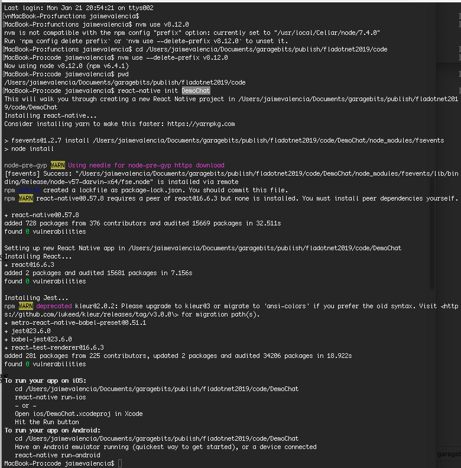
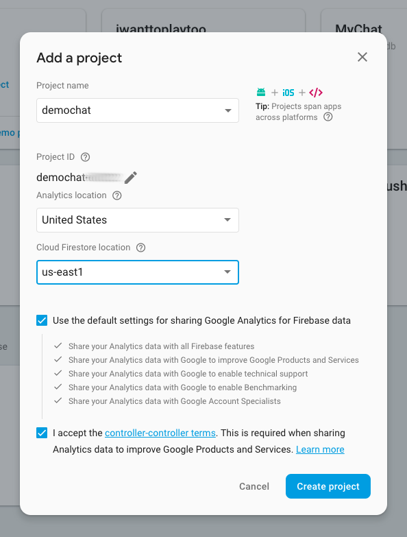
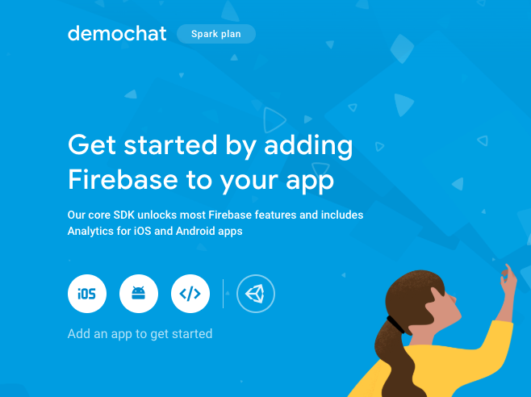
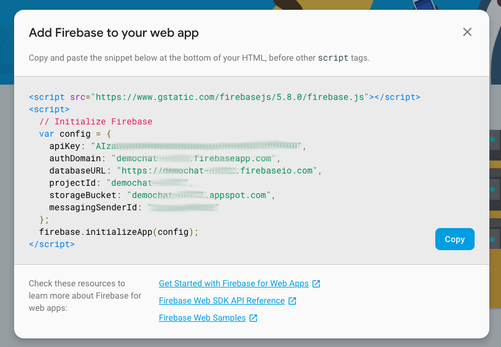
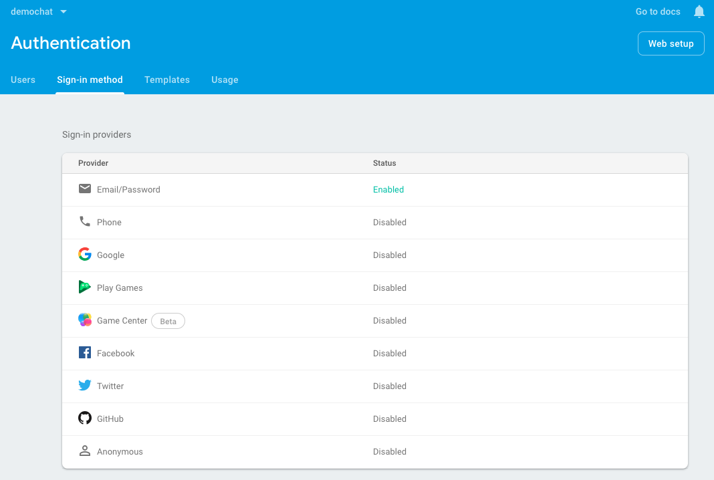
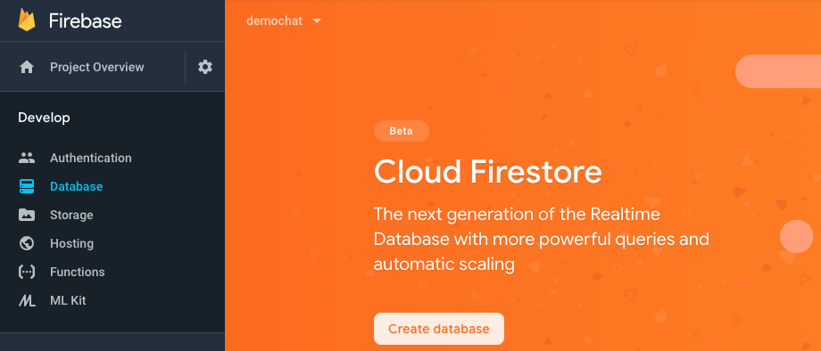
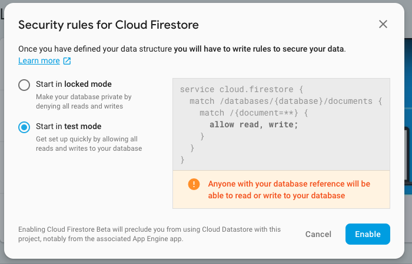
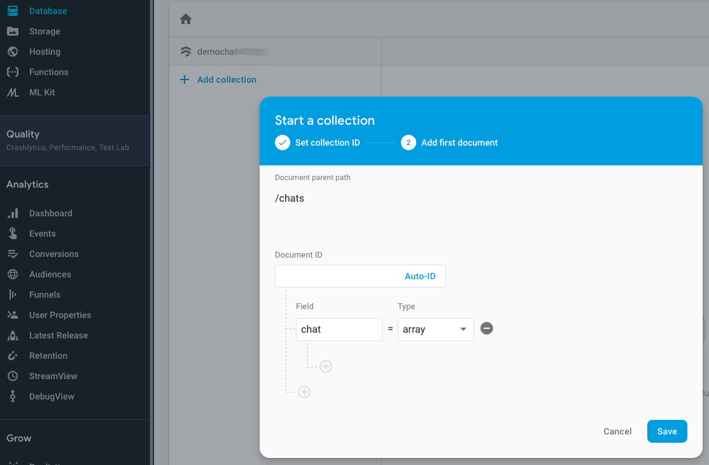
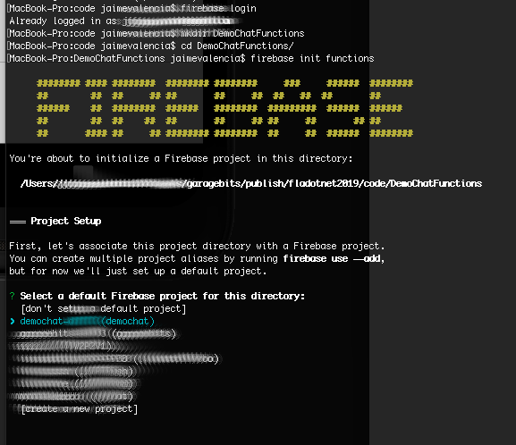
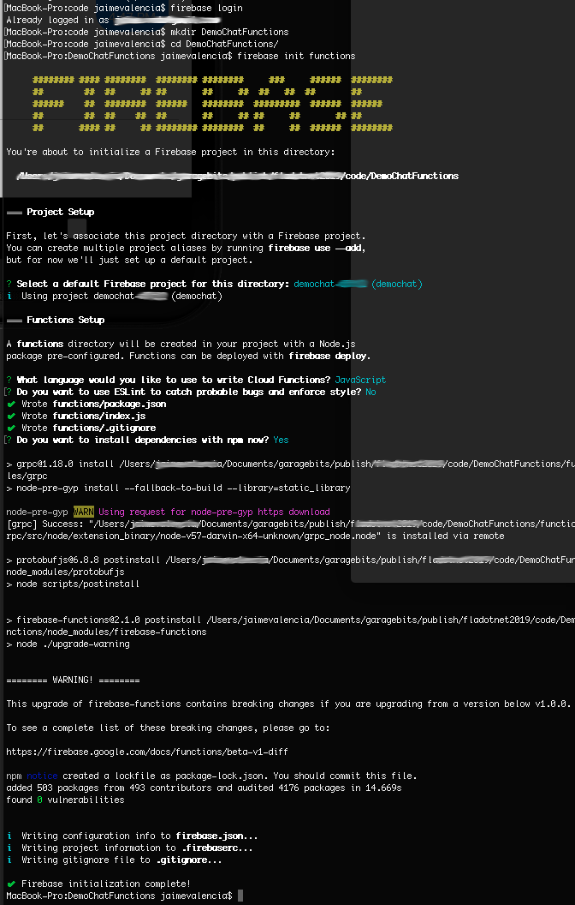

# Multilingual Chat --- WORK IN PROGRESS...































```
export const getDataConfig = () => {
 return {
   apiKey: "YOUR API KEY HERE",
   authDomain: "YOUR_APP_DOMAIN_HERE.firebaseapp.com",
   databaseURL: "https://YOUR_APP_DOMAIN_HERE.firebaseio.com",
   projectId: "YOUR_PROYECT_ID_HERE",
   storageBucket: "YOUR_APP_DOMAIN_HERE.appspot.com",
   messagingSenderId: "SOME ID HERE - PROVIDED BY FIREBASE"
 }
}


```
Set NODE - nvm to v8